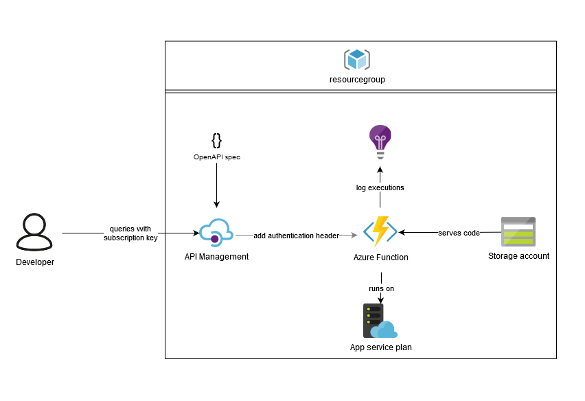

# Expose an Azure python function using API management

This repository coverse a minimal example of running simple python code securely as an API. We use the Azure cloud for deployment. Specifically the example deploys our python functions to Azure Functions, and uses an API management gateway to expose and secure it.

If you cannot wait to deploy, the following could work after cloning this repo:
```
az login
export collectionname="someonecollectionname"
sed -i "s/someone-testing-apim/$collectionname/g" api-spec.yml
terraform apply -var "collectionname=$collectionname"
cd func && func azure functionapp publish fa-$collectionname-func --python
```

## Overview of the setup

Main components:
- [Azure function](https://azure.microsoft.com/en-us/services/functions/): The Microsoft Azure way of offering serverless functions, it supports Python, which we shall be using. Microsoft offers 1 million free executions pers month. It has some limitations (mainly runtime), but for our API which should be quick this doesn't matter at all.
- [API Managament](https://azure.microsoft.com/en-us/services/api-management/): Microsoft describes it as "Hybrid, multi-cloud management platform for APIs across all environments". We will be using it to create a nice endpoint for our API's and secure it. Note that this thing gets [expensive](https://azure.microsoft.com/en-us/pricing/details/api-management/) when you want more. We will be using the Consompution tier with a million free calls.

Supporting components:
- Storage account: This is used to store the code we deploy to our function
- App service plan: This is to 'contain' our functions, which defines compute resources like RAM and CPU. However, for our functions we set it to 'Dynamic'. It is a little weird that we have to define what servers our serverless functions run on, [but I guess if you want to reserve compute it can be useful](https://docs.microsoft.com/en-us/azure/azure-functions/functions-scale).
- [Application insights](https://docs.microsoft.com/en-us/azure/azure-monitor/app/app-insights-overview): This stores all the output we create with our function in Application Insights, which can be very useful for debugging.
- Resource group: Just a logical grouping of resources. [There are some guidelines](https://docs.microsoft.com/en-us/azure/azure-resource-manager/management/overview#resource-groups) to help you define them. For this exmaple we are just using one.

<div style="text-align:center"></div>

**Security:**

In this setup the gateway is the only thing communicating directly with the functions. These can be many  different functions, with different keys. By configuring the functions to only accept requests from the gateway-IP (or place them in a vnet, but to get a fixed IP or vnet you need an expensive SKU for APIM) we can lock it down further.

In the API management we then see if the user is allowed to call a certain endpoint. In the example we use the build-in subscriptions, but this can be much more granulair by using [policies](https://docs.microsoft.com/en-us/azure/api-management/api-management-policies). One very useful one is the [validate JWT](https://docs.microsoft.com/en-us/azure/api-management/api-management-access-restriction-policies#ValidateJWT) policy.

Using only the (long lasting) subscription key might not be safe enough, the policies with JWT tokens mentioned above could be a solution

**API definition**

Working API-definition-first we have of course already made a specification, in the file `api-spec.yaml` (openAPI v3). We can import this in API management directly in terraform.

## Terraform

For this example everything is in `main.tf`, there are comments in the file to explain the purpose of the resources.

Some points of attention:
- The `Consompution` plan is only implemented in a working way from azurerm [release 2.8.1]
- There is still no way to get the [function key](https://docs.microsoft.com/en-us/azure/azure-functions/functions-bindings-http-webhook-trigger?tabs=python#authorization-keys) from the terraform object, so there is a workaround at the bottom.
- All secrets are stored plain text in the state file, save this in a secure location!

## Python function

Python is used a lot in the Data Science / Data Engineering scene. This methods allows us to quickly create simple, (or complex, backed by libraries) APIs. We can expose a whole [Flask API](https://github.com/pallets/flask) using [wsgi in Azure Functions]. For this example we simply write two methods, one for a POST request, the other for a GET request. [Azure has enought documenation](https://docs.microsoft.com/en-us/azure/developer/python/tutorial-vs-code-serverless-python-01) on creating python functions.

Points of attention:
- For our example to work, we need a 'function key', not anonymous authorization
- Installing dependencies (also custom packages) must be done to a special `.python_packages` directory

## Deployment

Unfortunately the API management deployment will take a long time, like 30 minutes. Check it out in the portal to see if the status is still 'Activating". However, this is only an issue the first time, you can update the function and other reousrces independently.

**Configure**
Pick a `collectionname`, and replace `someone-testing-apim` in `api-spec.yml` with this value.

- `export collectionname="someone-testing-apim"`
- `sed -i "s/someone-testing-apim/$collectionname/g" api-spec.yml`

**Terraform:**
- `az login` ([or some other method of authentication](https://www.terraform.io/docs/providers/azurerm/index.html))
- `terraform init`
- `terraform apply -var "collectionname=$collectionname" -var "adminemail=admin@example.com" -var "clientemail=client@example.com"`

You could also use a file and the argument `-var-file=filename`, or edit the variables in `main.tf`

**Azure function:**
- `cd func`
- `pip install -r requirements.txt --target=".python_packages/lib/site-packages"`
- `func azure functionapp publish fa-$collectionname-func --python --no-build`

This simple function will work without installing packages locally first, but the above method allows us to throw all (possibly private) packages in `.python_packages` and have them deployed as well.

## Testing

Right now you should have your API running. Log into the Azure portal, look for your APIM resource, go to subscriptions, click the three dots at the end of each row and pick 'show/hide' keys. Copy a key, and open your favourite request tester (like postman):

The API is now located at https://apim-<yourcollectionname>.azure-api.net/example/poster. We can hit the POST endpoint with a POST request on https://apim-<yourcollectionname>.azure-api.net/example/poster (try adding a body) and the get endpoint with a GET request on https://apim-<yourcollectionname>.azure-api.net/example/getter (try adding a query parameter named `message`)

We can also quickly query with curl: 
- Set our subscription key `export subkey=<yourkey>`
- `curl "https://apim-$collectionname.azure-api.net/example/getter?message=world" -H "Ocp-Apim-Subscription-Key: $subkey"`

## TODO:
- Describe update method
- Add automation template